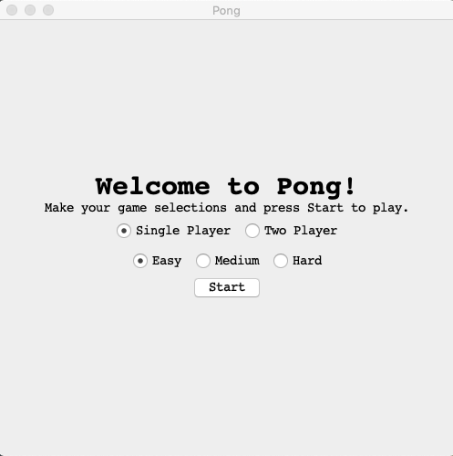
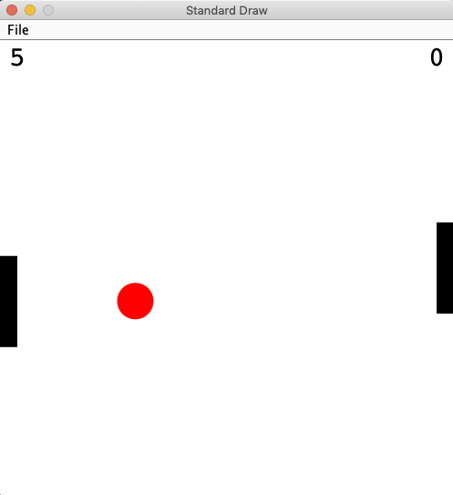
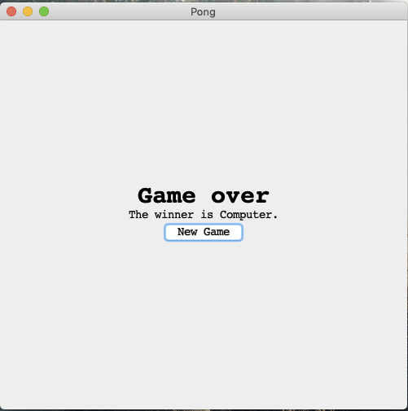

# Team 28 - Pong

### Members
Nikhil Maddirala, Thelma Boamah

### System requirements
* Java version 9 or later
* JUnit 5

### Starting the game
Clone this repo and start the application by running the main method in ```PongRunner.java```.
This will launch the welcome window.




Here, you will make your selections for
game mode and difficulty. In Single Player mode, you play against the computer.
In Two Player mode, you can play against an opponent sharing the same keyboard (or yourself).
The difficulty levels have variations in speed and number of obstacles.
After making your selections, click on start to launch the game window.


### Playing the game


Player 1 is the right hand paddle. As player 1, you play by using the up and down arrow keys to move your paddle.
If there's a second player, they will use the **W** key to move up and the **S** to move down. The first player to reach 11 points
wins the game.


Once someone has won, the game window will close and a final window will launch.



Here, you'll see who won and have the option to return to the starting screen by clicking on **New Game**. Optionally, you can
close the window to stop running the application.
